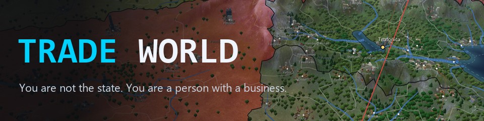
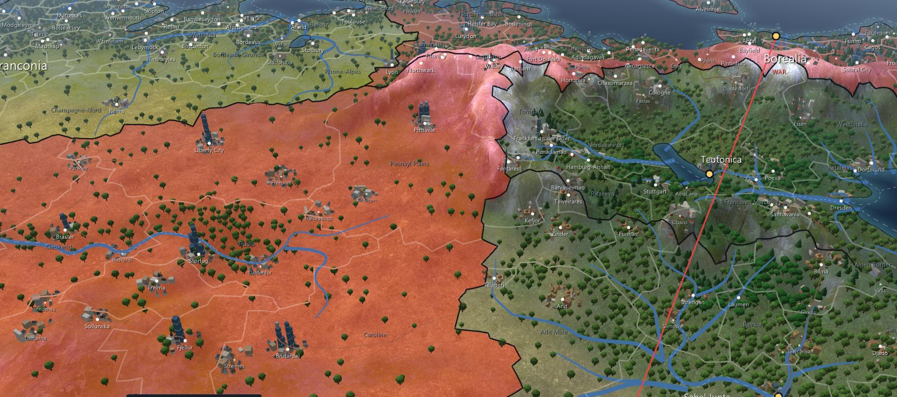
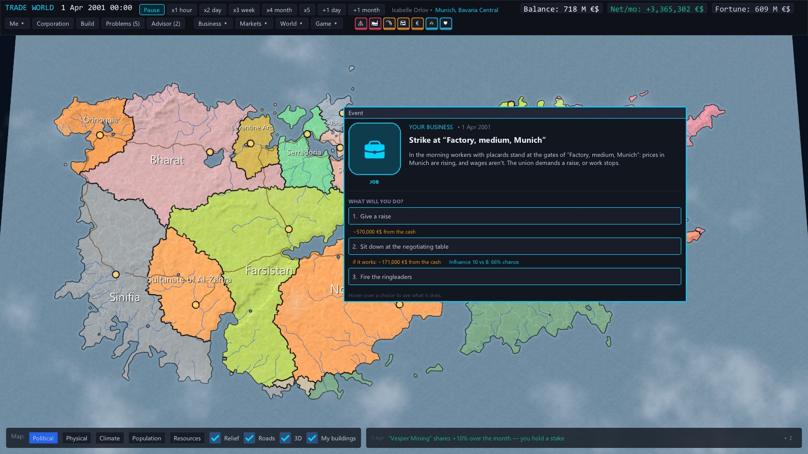
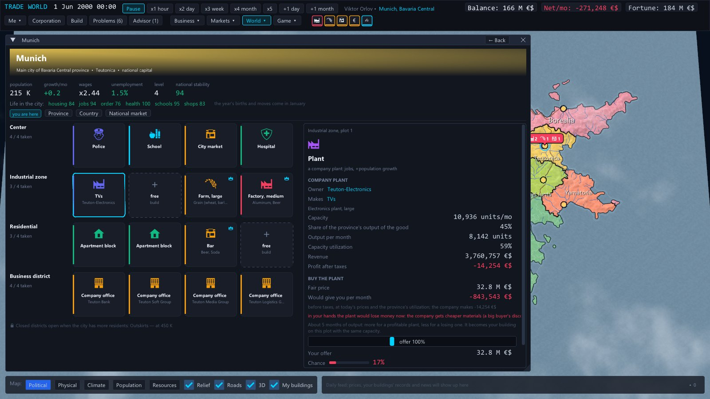
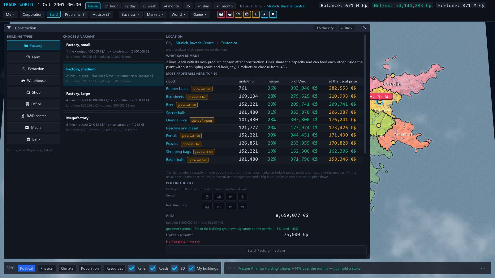
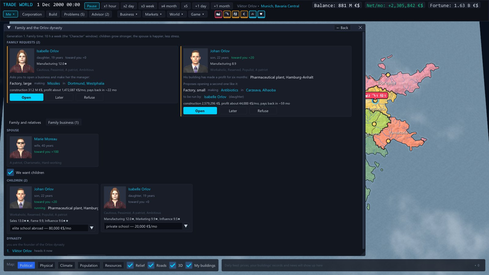
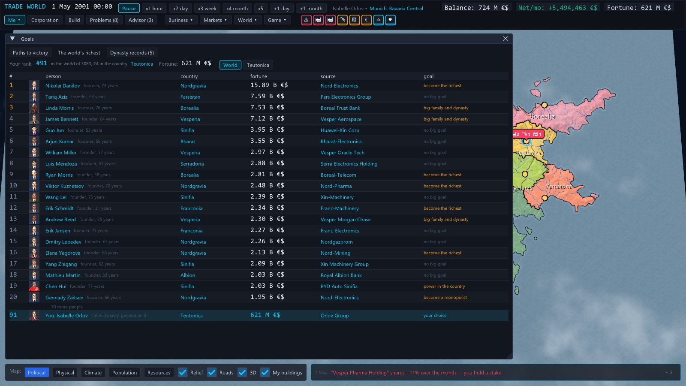
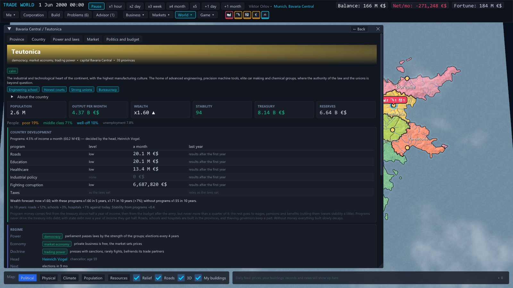
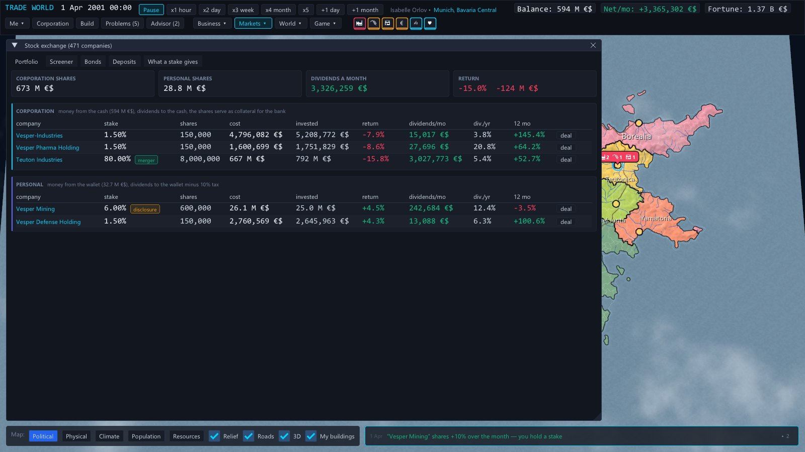

<h1 align="center">Trade World</h1>

<b>An economic sandbox in a living world.</b> You are not the state. You are a person with a business. 
<b>Экономическая песочница в живом мире.</b> Вы не государство. Вы человек с бизнесом.

  
  
   Free beta · English and Russian · zip ~85 MB · <a href="https://github.com/linlovedead/TradeWorld/releases">all versions</a> · <a href="CHANGELOG.md">what's new</a>

**[English](#english) · [Русский](#русский)**

---

## English

Seventeen fictional countries live on their own: they grow their economies, change rulers, go to war, get rich and go broke. You start as one person with a little money — and decide who to become: a monopolist, the richest person in the world, the head of a dynasty, or the ruler of a country.

Money turns into influence, and influence turns into laws. You build shops, plants and warehouses, link them into supply chains and take your corporation public. The world does not wait for you: companies swallow each other, governors steal the development money, neighbours fight over disputed land — and all of it hits your profit.

### What you can do

- **Build** — factories with several production lines, farms, mines, warehouses, 25 kinds of shops, offices, R&D centers, media and your own bank. 533 goods in production chains.
- **Trade** — your own prices at home and for export, state orders, price wars with retail chains; every good has its buyer: some pay for the brand, some for the price.
- **Grow** — headquarters and directors, an IPO, shares, raiders and the defence against them.
- **Rule** — spheres of influence, posts of governor and minister, elections and coups; the head of state decides where the treasury goes.
- **Carry on** — marriage, children who inherit their parents' traits, an heir, a family business.

### Screenshots

| | |
|---|---|
|  |  |
|  |  |
|  |  |
|  |  |

### How to run

1. Download `TradeWorld.zip` with the button above (or from [itch.io](https://linlovedead.itch.io/trade-world)).
2. Extract the archive **entirely** (right click → “Extract All…”).
3. Run `tradeworld.exe`.

Windows may warn about an unknown publisher: “More info → Run anyway”. Saves are kept in the `saves` folder next to the game.

**Requirements:** Windows 10/11 64-bit, a video card with OpenGL 3.3, 4 GB RAM, a screen of 1280×720 or more.
**Language:** English or Russian — Settings → Language; the first start follows the language of Windows.

### Found a bug?

In the game: **Game → Report a bug** — it packs your save and the log into one archive. Attach it to a [new issue](https://github.com/linlovedead/TradeWorld/issues) or a comment on [itch.io](https://linlovedead.itch.io/trade-world).

---

## Русский

Семнадцать вымышленных стран живут сами: строят экономику, меняют правителей, воюют, богатеют и беднеют. Вы начинаете одним человеком с небольшими деньгами — и решаете, кем стать: монополистом, богатейшим человеком мира, главой династии или правителем страны.

Деньги становятся влиянием, влияние становится законами. Вы строите магазины, заводы и склады, собираете цепочки поставок, выводите корпорацию на биржу. Мир при этом живёт без вас: компании поглощают друг друга, губернаторы воруют деньги на развитие, соседи воюют из-за спорной земли — и всё это сразу бьёт по вашей прибыли.

### Что вы можете

- **Строить** — фабрики с несколькими линиями, фермы, шахты, склады, 25 видов магазинов, офисы, НИИ, СМИ и свой банк. 533 товара в цепочках.
- **Торговать** — свои цены дома и на экспорт, госзаказ, ценовые войны с торговыми сетями; у каждого товара свой покупатель: кому бренд, кому цена.
- **Расти** — штаб-квартира и директора, IPO, акции, рейдеры и защита от них.
- **Властвовать** — сферы влияния, посты губернатора и министра, выборы и перевороты; глава страны решает, куда идёт казна.
- **Продолжаться** — брак, дети с чертами родителей, наследник, семейный бизнес.

### Скриншоты

| | |
|---|---|
|  |  |
|  |  |
|  |  |
|  |  |

### Как запустить

1. Скачайте `TradeWorld.zip` кнопкой выше (или на [itch.io](https://linlovedead.itch.io/trade-world)).
2. Распакуйте архив **целиком** (правой кнопкой → «Извлечь всё…»).
3. Запустите `tradeworld.exe`.

Windows может предупредить о неизвестном издателе: «Подробнее → Выполнить в любом случае». Сохранения лежат в папке `saves` рядом с игрой.

**Требования:** Windows 10/11 64 бит, видеокарта с OpenGL 3.3, 4 ГБ ОЗУ, экран от 1280×720.
**Язык:** русский или английский — «Настройки → Язык»; при первом запуске — по языку Windows.

### Нашли ошибку?

В игре: **«Игра → Сообщить об ошибке»** — соберётся архив с сохранением и журналом. Приложите его к [новому issue](https://github.com/linlovedead/TradeWorld/issues) или к комментарию на [itch.io](https://linlovedead.itch.io/trade-world).
