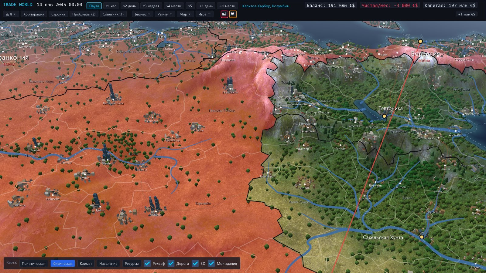
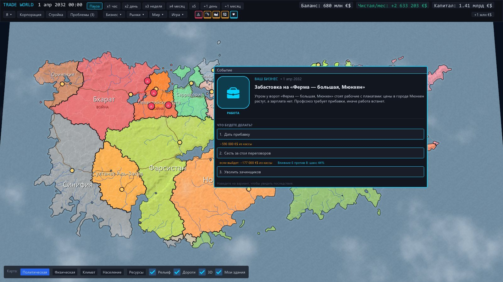
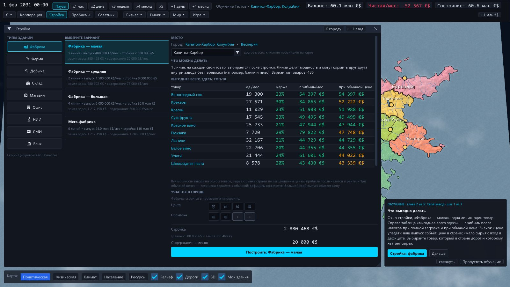
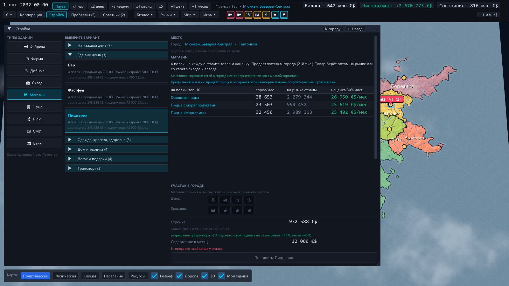
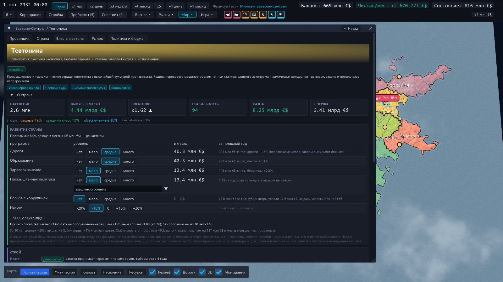
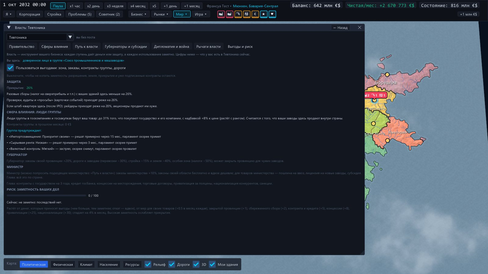
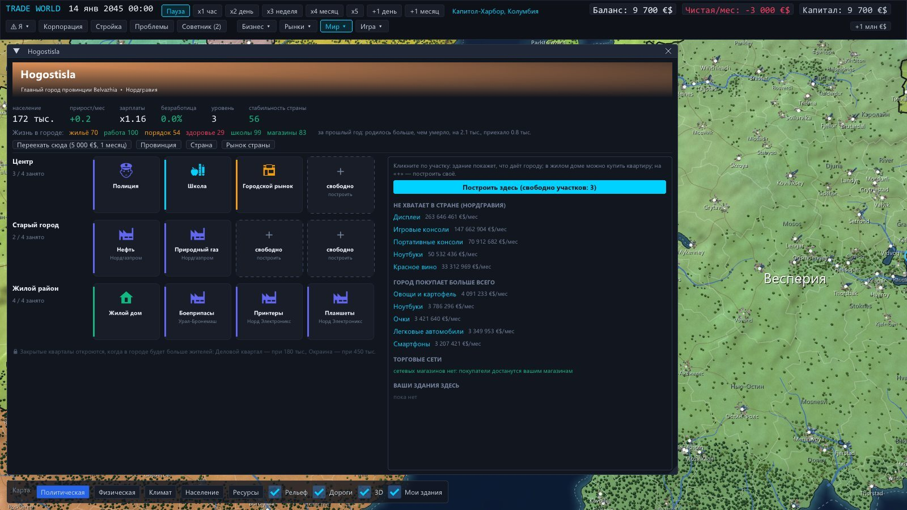
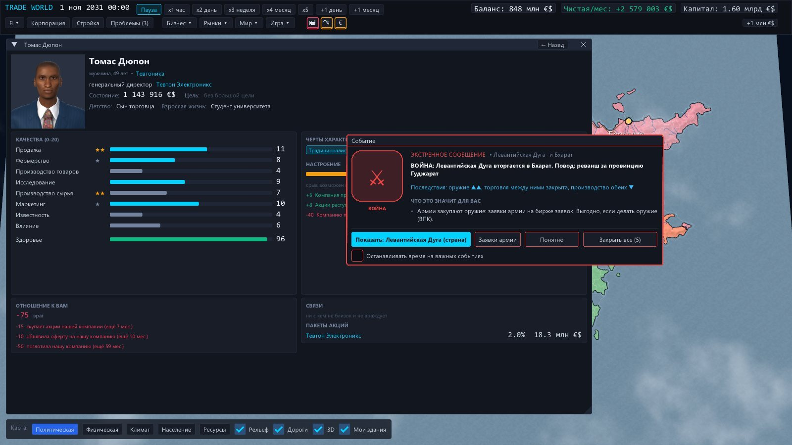
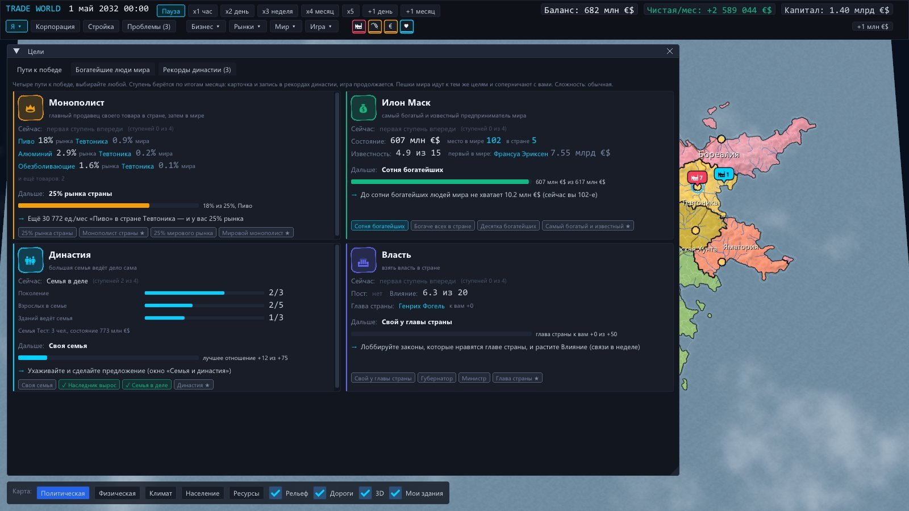

<h1 align="center">Trade World</h1>

<b>Экономическая песочница в живом мире.</b> Вы не государство. Вы человек с бизнесом.

  
   Бесплатная бета · архив ~85 МБ · <a href="https://github.com/linlovedead/TradeWorld/releases">все версии</a> · <a href="CHANGELOG.md">что нового</a>

---

Семнадцать вымышленных стран живут сами: строят экономику, меняют правителей, воюют, богатеют и беднеют. Вы начинаете одним человеком с небольшими деньгами — и решаете, кем стать: монополистом, богатейшим человеком мира, главой династии или правителем страны.

Деньги становятся влиянием, влияние становится законами. Вы строите магазины, заводы и склады, собираете цепочки поставок, выводите корпорацию на биржу. Мир при этом живёт без вас: компании поглощают друг друга, губернаторы воруют деньги на развитие, соседи воюют из-за спорной земли — и всё это сразу бьёт по вашей прибыли.

## Что вы можете

- **Строить** — фабрики с несколькими линиями, фермы, шахты, склады, 25 видов магазинов, офисы, НИИ, СМИ и свой банк. 533 товара в цепочках.
- **Торговать** — свои цены дома и на экспорт, госзаказ, ценовые войны с торговыми сетями; у каждого товара свой покупатель: кому бренд, кому цена.
- **Расти** — штаб-квартира и директора, IPO, акции, рейдеры и защита от них.
- **Властвовать** — сферы влияния, посты губернатора и министра, выборы и перевороты; глава страны решает, куда идёт казна.
- **Продолжаться** — брак, дети с чертами родителей, наследник, семейный бизнес.

## Скриншоты

| | |
|---|---|
|  |  |
|  |  |
|  |  |
|  |  |

## Как запустить

1. Скачайте `TradeWorld.zip` кнопкой выше.
2. Распакуйте архив **целиком** (правой кнопкой → «Извлечь всё…»).
3. Запустите `tradeworld.exe`.

Windows может предупредить о неизвестном издателе: «Подробнее → Выполнить в любом случае». Сохранения лежат в папке `saves` рядом с игрой.

**Требования:** Windows 10/11 64 бит, видеокарта с OpenGL 3.3, 4 ГБ ОЗУ, экран от 1280×720. Язык — русский.

## Нашли ошибку?

В игре: **«Игра → Сообщить об ошибке»** — соберётся архив с сохранением и журналом. Приложите его к [новому issue](https://github.com/linlovedead/TradeWorld/issues).
